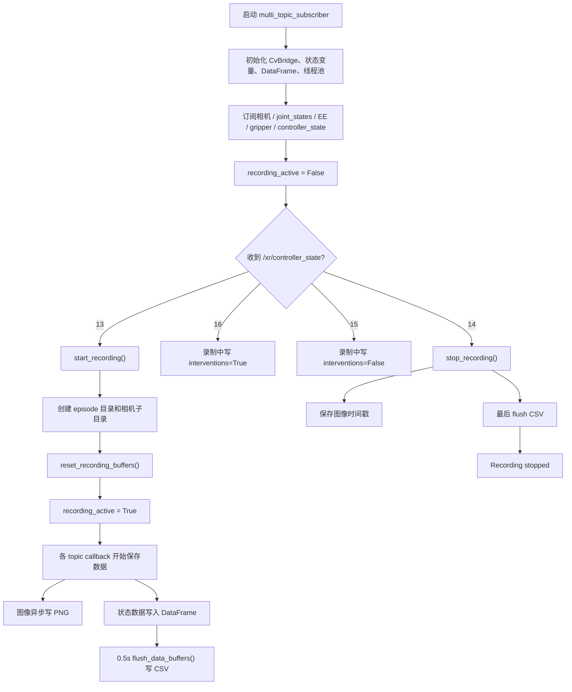

# 数采代码流程与改进建议

本文档用于说明当前 `ros2_data_collection` 项目里的数采代码是怎么工作的、每一部分负责什么、实际采集了哪些数据，以及后续哪些地方建议改、哪些地方可以暂时不动。

当前分析基于以下文件：

- `src/multi_subscriber/multi_subscriber/multi_subscriber.py`
- `src/multi_subscriber/multi_subscriber/multi_subscriber_sim_real.py`
- `src/multi_subscriber/align_dataset.py`
- `src/multi_subscriber/align_timestamps.py`
- `src/multi_subscriber/setup.py`
- `README.md`

## 1. 项目入口

ROS 2 包名是 `multi_subscriber`。

`setup.py` 里注册了三个命令：

| 命令 | 对应文件 | 作用 |
| --- | --- | --- |
| `multi_topic_subscriber` | `multi_subscriber.py` | 当前主数采节点，采真实相机、关节、EE、夹爪、intervention |
| `multi_topic_subscriber_sim_real` | `multi_subscriber_sim_real.py` | 同时采真实相机和 Isaac Sim 相机的旧/实验节点 |
| `isaac_test_subscriber` | `test.py` | 测试入口 |

当前真正应该运行的主命令是：

```bash
ros2 run multi_subscriber multi_topic_subscriber
```

README 里写的：

```bash
ros2 run multi_subscriber multi_subscriber
```

和 `setup.py` 不一致，后续需要修正。

## 2. 当前主数采节点总体流程

主节点是 `MultiTopicSubscriber`，位于：

```text
src/multi_subscriber/multi_subscriber/multi_subscriber.py
```

它的整体工作方式是：

1. 节点启动后，先只订阅话题，不立刻采集。
2. 收到 VR 手柄发来的 `/xr/controller_state=13` 后，开始录制。
3. 开始录制时创建一个 episode 目录。
4. 录制期间，各个 ROS topic 的 callback 持续把数据写入内存缓冲或异步写图像。
5. 定时器每 0.5 秒把脏数据 flush 到 CSV。
6. 收到 `/xr/controller_state=14` 后，停止录制并保存剩余数据。
7. 如果进程被 Ctrl+C 退出，且当前还在录制，也会尝试停止录制并保存。

流程图如下：



## 3. VR 控制码语义

当前代码里定义了四个控制码：

```python
START_RECORDING_CODE = 13
STOP_RECORDING_CODE = 14
INFERENCE_RESUMED_CODE = 15
INFERENCE_PAUSED_CODE = 16
```

实际语义应当是：

| 控制码 | 代码行为 | 业务语义 |
| --- | --- | --- |
| `13` | `start_recording()` | 开始数采，创建 episode 目录 |
| `14` | `stop_recording()` | 停止数采，保存当前 episode |
| `15` | 录制中写入 `interventions=False` | 模型恢复推理 / 人工接管结束 |
| `16` | 录制中写入 `interventions=True` | 模型暂停推理 / 准备人工接管 |

当前 callback 逻辑是正确的：

```python
def controller_state_callback(self, msg: Int32):
    if msg.data == START_RECORDING_CODE:
        self.start_recording()
    elif msg.data == STOP_RECORDING_CODE:
        self.stop_recording()
    elif msg.data == INFERENCE_RESUMED_CODE:
        if self.recording_active:
            self.interventions_active = False
            self.save_interventions_state(False)
    elif msg.data == INFERENCE_PAUSED_CODE:
        if self.recording_active:
            self.interventions_active = True
            self.save_interventions_state(True)
```

但代码里的订阅注释仍然写着旧语义：

```python
# 13/15 开始录制，14/16 停止录制
```

这个注释是错的，容易再次造成误解。建议后续修正。

## 4. 正常采集 Workflow

目标 workflow 应该是：

1. 启动模型推理。
   - 此时不采集数据。
   - 即使推理脚本启动时发出 `15`，数采节点也不应该开始录制。
2. 数采员通过 VR 手柄发送 `13`。
   - 数采节点开始录制。
   - 创建一个新的 episode 目录。
3. 模型自主运行。
   - 相机、关节、EE、夹爪等数据持续写入。
4. 数采员通过 VR 手柄发送 `16`。
   - 模型暂停。
   - 数采继续。
   - `interventions.csv` 追加一条 `True`。
5. 数采员通过右摇杆开始人工接管。
   - 真机进入人工控制。
   - 数采继续。
   - 当前数采节点本身不直接感知右摇杆动作。
6. 数采员通过右摇杆结束人工接管。
   - 真机退出人工控制。
   - 数采继续。
   - 当前数采节点不会因此自动写 `False`。
7. 数采员通过 VR 手柄发送 `15`。
   - 模型恢复推理。
   - 数采继续。
   - `interventions.csv` 追加一条 `False`。
8. 一条任务结束后，数采员发送 `14`。
   - 数采停止。
   - 当前 episode 完整保存。

关键点：

- `13/14` 是数采启停。
- `15/16` 不是数采启停，只是模型推理状态和 intervention 标记。
- 右摇杆控制的是人工遥操模式，当前数采节点没有直接订阅右摇杆状态。

## 5. 订阅了哪些话题

主节点订阅的话题如下：

| 数据类型 | ROS topic | 消息类型 | 保存位置 |
| --- | --- | --- | --- |
| 头部相机 | `/camera_head/color/image_raw` | `sensor_msgs/Image` | `camera_head/` + `camera_head_timestamps.csv` |
| 左腕相机 | `/camera_left_wrist/color/image_raw` | `sensor_msgs/Image` | `camera_left_wrist/` + `camera_left_wrist_timestamps.csv` |
| 右腕相机 | `/camera_right_wrist/color/image_raw` | `sensor_msgs/Image` | `camera_right_wrist/` + `camera_right_wrist_timestamps.csv` |
| 关节状态 | `/joint_states` | `sensor_msgs/JointState` | `joint_states.csv` |
| 左末端当前位姿 | `/left_current_pose` | `geometry_msgs/PoseStamped` | `left_ee_data.csv` |
| 右末端当前位姿 | `/right_current_pose` | `geometry_msgs/PoseStamped` | `right_ee_data.csv` |
| 左末端目标位姿 | `/left_current_target` | `geometry_msgs/PoseStamped` | `left_ee_target_data.csv` |
| 右末端目标位姿 | `/right_current_target` | `geometry_msgs/PoseStamped` | `right_ee_target_data.csv` |
| 左夹爪指令 | `/left_gripper_controller/target_command` | `std_msgs/Int32` | `left_gripper_command.csv` |
| 右夹爪指令 | `/right_gripper_controller/target_command` | `std_msgs/Int32` | `right_gripper_command.csv` |
| VR 控制状态 | `/xr/controller_state` | `std_msgs/Int32` | 控制录制和 `interventions.csv` |

## 6. 输出目录结构

当前主节点开始录制时，会把数据写到：

```text
/home/zihang/ros2_ws/raw_datasets/<timestamp>/
```

其中 `<timestamp>` 格式为：

```text
YYYYMMDD_HHMMSS_microseconds
```

一个 episode 目录大致如下：

```text
raw_datasets/<timestamp>/
├── camera_head/
│   ├── head_image0.png
│   ├── head_image1.png
│   └── ...
├── camera_left_wrist/
│   ├── left_wrist_image0.png
│   └── ...
├── camera_right_wrist/
│   ├── right_wrist_image0.png
│   └── ...
├── camera_head_timestamps.csv
├── camera_left_wrist_timestamps.csv
├── camera_right_wrist_timestamps.csv
├── joint_states.csv
├── left_ee_data.csv
├── right_ee_data.csv
├── left_ee_target_data.csv
├── right_ee_target_data.csv
├── left_gripper_command.csv
├── right_gripper_command.csv
└── interventions.csv
```

注意：

- `interventions.csv` 只有在录制期间收到 `15/16` 才会生成或更新。
- 如果一条 episode 里没有发生接管，可能没有 `interventions.csv`，或者文件为空。
- 当前代码使用本机 `datetime.now()` 生成时间戳，不使用 ROS 消息自带的 `header.stamp`。

## 7. 每个核心函数在做什么

### `__init__()`

负责初始化节点：

- 创建 `CvBridge`
- 初始化录制状态
- 初始化 DataFrame 缓冲区
- 配置预览窗口参数
- 配置最大 head 帧数 `max_head_frames = 10000`
- 创建图像写盘线程池
- 创建 callback group
- 订阅所有 ROS topic
- 创建 0.5 秒一次的 flush timer

### `reset_recording_buffers()`

负责重置一条 episode 的所有内存缓冲：

- `joint_states_data`
- `left_ee_data`
- `right_ee_data`
- `left_ee_target_data`
- `right_ee_target_data`
- `left_gripper_command_data`
- `right_gripper_command_data`
- `interventions_data`
- 三路图像时间戳列表
- 图像计数器
- dirty 标记
- 样本计数

每次新开始录制都会调用它。

### `start_recording()`

收到 `13` 后调用。

主要动作：

1. 如果已经在录制，直接忽略。
2. 生成当前时间戳。
3. 创建 episode 根目录。
4. 创建三路相机目录。
5. 重置所有缓冲。
6. 设置 `recording_active = True`。

### `stop_recording()`

收到 `14` 或节点退出时调用。

主要动作：

1. 如果当前没有录制，直接忽略。
2. 设置 `recording_active = False`。
3. 写三路图像时间戳 CSV。
4. flush 所有还没落盘的 DataFrame。
5. 打印 `Recording stopped`。

### `save_image()`

三路相机共用的保存逻辑。

主要动作：

1. 如果不在录制，直接返回。
2. 把 ROS `Image` 转成 OpenCV 图像。
3. 用当前系统时间生成 timestamp。
4. 检查 head 相机是否超过 `max_head_frames`。
5. 生成图片文件名。
6. 把图像提交给线程池异步写盘。
7. 在内存中记录图片文件名和 timestamp。
8. 可选预览图像。
9. 更新计数器。

### `write_image_async()`

在线程池里执行图像写盘。

它先把图像编码成 PNG，写到临时文件，再用 `os.replace()` 原子替换成目标文件。这样比直接写目标文件更不容易留下半写入图片。

### `save_joint_state()`

保存 `/joint_states`。

当前假设 `msg.position` 至少有 16 个元素，并按固定顺序写入：

- 左夹爪 joint
- 左臂 7 个 joint
- 右夹爪 joint
- 右臂 7 个 joint

写入内存 DataFrame 后，设置 `joint_states_dirty = True`，等待 timer flush。

### `save_left_ee_pose()` / `save_right_ee_pose()`

保存左右当前末端位姿：

- position: x, y, z
- orientation: x, y, z, w

保存到：

- `left_ee_data.csv`
- `right_ee_data.csv`

### `save_left_ee_target()` / `save_right_ee_target()`

保存左右目标末端位姿。

保存到：

- `left_ee_target_data.csv`
- `right_ee_target_data.csv`

### `save_left_gripper_command()` / `save_right_gripper_command()`

保存左右夹爪命令事件。

格式是：

```csv
timestamp,value
...
```

### `save_interventions_state()`

保存接管状态事件。

格式是：

```csv
timestamp,value
...,True
...,False
```

语义：

- `True`：模型暂停 / 专家接管开始
- `False`：模型恢复 / 专家接管结束

需要注意：这里记录的是 `15/16` 的时间，不一定是右摇杆真正进入或退出人工遥操的精确时间。

### `flush_data_buffers()`

每 0.5 秒执行一次。

它根据各个 dirty 标记决定是否写 CSV：

- `joint_states.csv`
- `left_ee_data.csv`
- `right_ee_data.csv`
- `left_ee_target_data.csv`
- `right_ee_target_data.csv`
- `left_gripper_command.csv`
- `right_gripper_command.csv`
- `interventions.csv`

当前写法是每次把整个 DataFrame 全量写回 CSV，不是 append。

### `save_image_timestamps()`

停止录制时保存三路图像时间戳。

输出：

- `camera_head_timestamps.csv`
- `camera_left_wrist_timestamps.csv`
- `camera_right_wrist_timestamps.csv`

### `main()`

主入口：

1. `rclpy.init()`
2. 创建 `MultiTopicSubscriber`
3. 使用 `MultiThreadedExecutor(num_threads=4)`
4. `executor.spin()`
5. 退出时：
   - 停止 executor
   - 如果仍在录制，调用 `stop_recording()`
   - 等待图像线程池结束
   - 销毁节点
   - `rclpy.shutdown()`

## 8. `multi_subscriber_sim_real.py` 是什么

这个脚本用于同时采集：

- 真实三路相机
- Isaac Sim 三路相机
- `/joint_states`
- 左右当前 EE pose

但它和主数采脚本差异很大：

| 项 | `multi_subscriber.py` | `multi_subscriber_sim_real.py` |
| --- | --- | --- |
| 是否 VR 控制启停 | 是，13/14 控制 | 否，节点启动就开始采 |
| 是否记录 intervention | 是 | 否 |
| 是否采 EE target | 是 | 否 |
| 是否采夹爪命令 | 是 | 否 |
| 图像写盘方式 | 线程池异步写 PNG | callback 内同步 `cv2.imwrite()` |
| CSV 写盘方式 | 0.5 秒 timer flush | 每条数据 callback 内立即全量写 CSV |
| 输出目录 | `/home/zihang/ros2_ws/raw_datasets/<timestamp>` | `/home/zihang/ros2_ws/<timestamp>` |
| Executor | `MultiThreadedExecutor` | 默认 `rclpy.spin()` |
| 预览参数 | ROS 参数 `enable_preview`，默认 False | 写死 True |

因此它目前更像旧版或实验脚本，不建议和主 workflow 混用。

如果以后还需要 sim-real 同采，建议不要继续维护两套完全不同逻辑，而是把“真实相机源”和“Isaac 相机源”作为可配置输入，统一到一套录制状态机里。

## 9. 后处理脚本

### `align_dataset.py`

用途：把一条 episode 里的多模态数据按时间戳对齐，生成 `aligned_dataset.csv`。

它读取：

- `joint_states.csv`
- `left_ee_data.csv`
- `right_ee_data.csv`
- 三路 image timestamps CSV

它以 `joint_states.csv` 的每一行作为主时间轴，然后在指定 tolerance 内找最近的：

- 左 EE pose
- 右 EE pose
- head 图像
- left_wrist 图像
- right_wrist 图像

默认 tolerance 是 100ms。

不足：

- 不读取 `left_ee_target_data.csv` / `right_ee_target_data.csv`
- 不读取 `left_gripper_command.csv` / `right_gripper_command.csv`
- 不读取 `interventions.csv`
- 使用采集时的系统时间，不是 ROS message stamp
- 不是 `setup.py` 注册的命令，不能直接 `ros2 run`

### `align_timestamps.py`

用途：把一个相机的图片和 `joint_states.csv` 对齐，并生成视频。

它更像临时工具或早期验证脚本：

- 只处理单路相机
- fps 写死为 30
- 输入文件路径写死为当前目录下的示例文件
- 不适合作为正式数据处理 pipeline

## 10. 当前代码已经做得比较好的地方

这些地方可以先保留，不需要优先改：

1. `13/14/15/16` 的主控制逻辑已经符合当前 workflow。
2. 图像写盘用了线程池，避免相机 callback 被 `cv2.imwrite()` 长时间阻塞。
3. PNG 写盘用了临时文件 + `os.replace()`，比直接写目标文件更安全。
4. 数据缓冲有 dirty 标记，不是每条消息都立刻写 CSV。
5. 使用 `MultiThreadedExecutor` 和 callback group，至少已经考虑了多 topic 并发。
6. 退出时如果还在录制，会调用 `stop_recording()`，能减少未保存数据。
7. `enable_preview` 是 ROS 参数，默认关闭，适合无人值守采集。

## 11. 当前最容易混乱的地方

### 11.1 README 启动命令不对

README 当前写的是：

```bash
ros2 run multi_subscriber multi_subscriber
```

实际应该是：

```bash
ros2 run multi_subscriber multi_topic_subscriber
```

建议优先修。

### 11.2 控制码注释仍然是旧逻辑

代码里还有：

```python
# 13/15 开始录制，14/16 停止录制
```

这和真实逻辑冲突。建议优先修，否则后续维护者很容易把 bug 改回来。

### 11.3 输出路径硬编码

当前写死：

```python
self.base_folder = f"/home/zihang/ros2_ws/raw_datasets/{timestamp}"
```

问题：

- 换机器、换用户、换 workspace 都要改代码。
- 文档里有些地方还按 `/home/zihang/ros2_ws/<timestamp>` 找数据，容易找错。
- 不利于自动测试。

建议改成 ROS 参数，例如：

```bash
ros2 run multi_subscriber multi_topic_subscriber --ros-args -p output_dir:=/home/zihang/ros2_ws/raw_datasets
```

### 11.4 `interventions.csv` 的语义容易被误解

当前 `interventions=True/False` 是由 `16/15` 触发的。

它表示：

- 模型暂停 / 恢复
- 逻辑上近似专家接管开始 / 结束

但它不一定等于：

- 右摇杆真正按下的时间
- 真机实际进入 teleop 的时间
- 人手真正开始施加控制的时间

如果训练数据需要精确区分“模型暂停”和“人工控制”，建议新增独立字段或事件文件。

### 11.5 `multi_subscriber_sim_real.py` 与主脚本分叉严重

这个文件目前不适合直接参与主 workflow，因为：

- 不受 VR 启停控制
- 不记录 intervention
- 输出路径不同
- 写盘策略不同
- 采集字段不同

如果继续保留，需要明确标注为实验脚本；如果要正式使用，需要对齐主脚本。

### 11.6 停止录制时不等待图像线程池完成当前队列

`stop_recording()` 会保存时间戳和 flush CSV，但不会等待图像写盘线程池把已提交的图片全部写完。

进程正常退出时，`finally` 里会 `image_thread_pool.shutdown(wait=True)`，但如果只是按 `14` 停止一条 episode 后马上开始下一条，理论上可能仍有上一条 episode 的图片写盘任务在后台执行。

建议在每条 episode 停止时就等待或管理 pending image futures。

### 11.7 时间戳使用本机接收时间，不使用 ROS 消息时间

当前每条数据都调用：

```python
datetime.now()
```

这记录的是 callback 执行时间，不一定是传感器采样时间。

如果多模态精确对齐很重要，建议优先改为：

- 图像使用 `msg.header.stamp`
- JointState 使用 `msg.header.stamp`
- PoseStamped 使用 `msg.header.stamp`
- 没有 header 的事件类消息再使用本机时间或节点 clock

### 11.8 高频日志太多

左右 EE pose 当前每收到一条就打印一次 position/orientation。高频运行时日志会非常多，掩盖控制事件日志。

建议改为：

- 每 N 条打印一次
- 或只 debug 级别打印
- info 级别只保留录制启停、intervention、异常等关键事件

### 11.9 DataFrame 全量重写 CSV 可能越来越慢

当前每次 flush 都是：

```python
self.joint_states_data.to_csv(path, index=False)
```

随着 episode 变长，每 0.5 秒全量重写会越来越慢。

短 episode 问题不大；长时间采集时建议改为 append 或分块写。

### 11.10 `max_head_frames=10000` 会自动停止录制

head 相机达到 10000 帧后会自动 `stop_recording()`。

这个逻辑可能是保护机制，但对数采员来说不明显。长任务中可能还没按 `14`，录制已经停了。

建议：

- 改成 ROS 参数
- 日志更明显
- 或默认不自动停，只报警

### 11.11 `abort_recording()` 暂时没有调用

代码里有删除当前 episode 的 abort 逻辑，但没有任何地方调用。

如果需要“废弃本条数据”的功能，可以接入一个新的控制码或服务；如果不需要，可以删除，减少干扰。

### 11.12 `interventions_active` 只写不读

代码设置了 `self.interventions_active`，但没有用它做状态判断、去重或校验。

例如连续收到多个 `16` 会重复写多个 `True`。

建议：

- 如果要保留状态，就用它避免重复事件。
- 如果不需要，就删掉这个变量。

### 11.13 关节数组长度没有校验

当前假设 `joint_positions[0]` 到 `joint_positions[15]` 都存在。

如果机器人配置变化，或者 `/joint_states` 顺序变化，可能直接异常或保存错位。

建议至少检查长度，更好的做法是按 joint name 映射，而不是按固定 index。

## 12. 建议改进清单

### 第一优先级：先消除误导和运行混乱

这些改动风险低、收益高，建议优先做：

| 建议 | 文件 | 原因 |
| --- | --- | --- |
| 修正 README 运行命令 | `README.md` | 避免用户运行错误命令 |
| 修正 controller 注释 | `multi_subscriber.py` | 避免把 15/16 再误解成录制启停 |
| 在 README 写清楚唯一有效入口 | `README.md` | 避免多脚本、多路径混淆 |
| 标注 `sim_real` 当前不是主 workflow | `README.md` / 文档 | 避免误用 |
| 统一文档中的输出目录 | README / docs | 避免找错 episode |

这些不改变采集行为，只改文档和注释，基本不会引入运行风险。

### 第二优先级：让采集路径和参数可配置

建议把硬编码配置改成 ROS 参数：

| 参数 | 默认值建议 | 当前硬编码 |
| --- | --- | --- |
| `output_dir` | `/home/zihang/ros2_ws/raw_datasets` | 写死在 `start_recording()` |
| `max_head_frames` | `10000` 或 `0` 表示不限制 | 写死在 `__init__()` |
| `enable_preview` | `False` | 已经是参数 |
| `flush_interval_sec` | `0.5` | 写死在 timer |

这样后续换机器、换路径、换采集策略时不需要改代码。

### 第三优先级：明确状态机和事件语义

建议把当前隐式逻辑整理成显式状态：

```text
IDLE
  └── 13 → RECORDING_AUTONOMOUS

RECORDING_AUTONOMOUS
  ├── 16 → RECORDING_INTERVENTION
  └── 14 → IDLE

RECORDING_INTERVENTION
  ├── 15 → RECORDING_AUTONOMOUS
  └── 14 → IDLE
```

好处：

- 连续收到两个 `16` 时不重复写 `True`
- 没录制时收到 `15/16` 可以明确打日志说明忽略
- 停止录制时可以记录最终状态
- 后续扩展 abort / invalid episode 更容易

### 第四优先级：提高数据可靠性

建议：

1. 停止 episode 时等待该 episode 的图像写盘任务完成。
2. 使用 ROS `header.stamp` 作为传感器时间戳。
3. 给 `joint_states` 增加长度或 name 校验。
4. 对 CSV 写盘改 append 或分块，避免长 episode 越来越慢。
5. 增加 `metadata.json`，记录：
   - episode id
   - start time / stop time
   - 控制码事件
   - 代码版本
   - output schema version
   - 是否正常结束

### 第五优先级：统一 sim-real 脚本

如果以后还要采 Isaac Sim + real 同步数据，建议把 `multi_subscriber_sim_real.py` 重构为主节点的一种模式，而不是维护两套节点。

可以考虑：

```bash
ros2 run multi_subscriber multi_topic_subscriber --ros-args \
  -p enable_sim_cameras:=true \
  -p enable_real_cameras:=true
```

然后主节点根据参数决定订阅哪些相机。

## 13. 哪些地方建议先不要动

如果当前目标是先保证真机 RECAP workflow 能稳定采集，下面这些可以暂时不动：

1. `13/14/15/16` 的核心 callback 行为。
   - 当前已经符合目标 workflow。
2. 三路真实相机 topic 名。
   - 除非硬件或 launch 改了。
3. EE / target / gripper 的 CSV 字段名。
   - 已经可能被后处理或训练脚本依赖。
4. `align_dataset.py`。
   - 如果当前训练暂时不用它，可以先不动；但正式 pipeline 前需要补齐 intervention/target/gripper。
5. 图像文件命名方式。
   - 只要下游已依赖 `head_image0.png` 这种格式，短期不要改。
6. `enable_preview` 默认 False。
   - 这是合理的，采集时不应默认开窗口。

## 14. 推荐修改路线

### 阶段 1：无行为风险的清理

目标：不改变采集逻辑，只消除误导。

建议改：

- README 运行命令
- `multi_subscriber.py` 中错误注释
- 文档中输出路径
- 明确 `multi_subscriber_sim_real.py` 不是当前主 workflow

### 阶段 2：参数化和日志整理

目标：让运行更稳、更清楚。

建议改：

- `output_dir` 参数化
- `max_head_frames` 参数化
- `flush_interval_sec` 参数化
- 高频 EE 日志降级或限频
- 忽略 `15/16` 时打印清晰 debug/info

### 阶段 3：状态机与数据可靠性

目标：避免重复事件和边界条件问题。

建议改：

- 显式录制状态机
- intervention 去重
- 停止录制时等待当前 episode 图像写盘完成
- 增加 `metadata.json`
- joint_states 按 name 或长度校验

### 阶段 4：时间戳和后处理 pipeline

目标：提高训练数据质量。

建议改：

- 使用 ROS message timestamp
- `align_dataset.py` 支持 target、gripper、intervention
- 后处理脚本注册为 console script
- 明确输出 schema

### 阶段 5：sim-real 统一

目标：减少两套代码分叉。

建议改：

- 把 sim camera 作为主节点可选订阅项
- 删除或降级旧 `multi_subscriber_sim_real.py`
- 统一输出目录、控制方式、CSV schema

## 15. 简短结论

当前主数采代码的核心 workflow 已经是：

```text
13 开始采集
16 记录人工干预开始
15 记录人工干预结束
14 停止采集
```

这部分先不要轻易改。

最应该先改的是不会影响行为的混乱点：

1. README 命令错误。
2. 代码里 13/15、14/16 的旧注释错误。
3. 输出路径硬编码。
4. `sim_real` 和主脚本职责不清。
5. `interventions.csv` 的语义需要在文档中写清楚。

等这些整理完，再考虑状态机、时间戳、图像写盘等待和后处理 pipeline。
