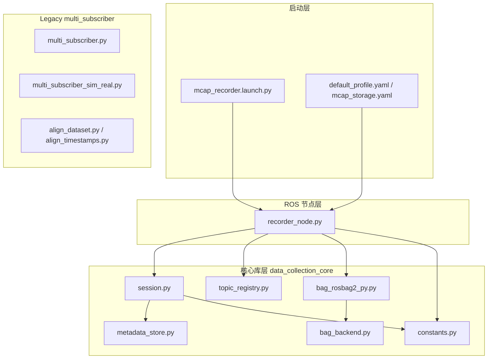

# 项目分级与各 Python 文件说明

本文档说明 `ros2_data_collection` 仓库的目录分级、包依赖关系，以及**每个 `.py` 文件**的职责。便于新人上手和后续重构对照。

相关文档：

- [数采流程与改进建议](data_collection_code_flow_and_refactor_plan.md)
- [MCAP 重构方案](refactor_project_structure_and_mcap_recording.md)

---

## 1. 仓库总览

```text
ros2_data_collection/
├── README.md                          # 运行入口、MCAP vs legacy 对比
├── docs/                              # 文档（不参与 ROS 运行）
├── .gitignore
│
└── src/
    ├── data_collection_core/          # L1 核心库（无 ROS Node）
    ├── data_collection_recorder/      # L2 ROS 节点 + 配置 + Launch
    └── multi_subscriber/              # Legacy 旧版 PNG+CSV 数采
```

说明：`build/`、`install/`、`log/` 为 `colcon build` 产物，**以 `src/` 为准**。

---

## 2. 项目分级与依赖

### 2.1 分层表

| 层级 | 路径 | 是否 ROS Node | 职责 |
|------|------|---------------|------|
| **文档** | `docs/` | 否 | 流程、重构、本文件索引 |
| **配置** | `data_collection_recorder/config/recording/` | 否 | 录制 topic 列表、MCAP 压缩参数 |
| **启动** | `data_collection_recorder/launch/` | 否 | 启动 `mcap_recorder` 并传参 |
| **L1 核心** | `data_collection_core` | 否 | 状态机、metadata、MCAP 写盘抽象 |
| **L2 节点** | `data_collection_recorder` | **是** | 订阅话题、驱动录制、写 bag |
| **Legacy** | `multi_subscriber` | **是** | 旧 PNG/CSV 落盘（fallback） |

### 2.2 依赖关系图



### 2.3 运行时数据流（MCAP 路径）

```text
VR / 推理 发布 /xr/controller_state (13/14/15/16)
        │
        ▼
┌───────────────────────────────────────┐
│  recorder_node.py (mcap_recorder)      │
│  • 订阅 profile 中全部 topic           │
│  • 13: session.start + backend.start  │
│  • 14: backend.stop + session.stop    │
│  • 15/16: session → metadata.json     │
│  • 其它 topic: CDR 序列化 → MCAP      │
└───────────────────────────────────────┘
        │                    │
        ▼                    ▼
 metadata.json          recording/*.mcap
 (sidecar 事件)          (rosbag2 + zstd)
```

---

## 3. 日常入口命令

| 用途 | 命令 | 对应主文件 |
|------|------|------------|
| **新 MCAP 数采（推荐）** | `ros2 launch data_collection_recorder mcap_recorder.launch.py` | `recorder_node.py` |
| 直接 run 节点 | `ros2 run data_collection_recorder mcap_recorder` | `recorder_node.py` |
| 旧 PNG+CSV | `ros2 run multi_subscriber multi_topic_subscriber` | `multi_subscriber.py` |
| Sim+真机旧脚本 | `ros2 run multi_subscriber multi_topic_subscriber_sim_real` | `multi_subscriber_sim_real.py` |

VR 控制码（两条路径语义一致）：

| 码值 | 行为 |
|------|------|
| `13` | 开始录制 |
| `14` | 停止录制 |
| `15` | 记录 intervention 结束（MCAP 路径写 metadata；legacy 写 CSV） |
| `16` | 记录 intervention 开始 |

---

## 4. 包 `data_collection_core`（L1 核心库）

路径：`src/data_collection_core/data_collection_core/`

**特点：** 不包含 `rclpy.Node`，不能 `ros2 run`；供 `data_collection_recorder` 调用，也可单独单测。

| 文件 | 作用 |
|------|------|
| `__init__.py` | 包标记，无业务逻辑。 |
| `constants.py` | 全局常量：`START/STOP/INFERENCE_RESUMED/INFERENCE_PAUSED`（13/14/15/16）；默认控制话题 `/xr/controller_state`；默认 profile 路径字符串。 |
| `metadata_store.py` | 维护 episode 旁 **`metadata.json`**：起止时间、`status`、`storage` 信息、`events[]`（`intervention_start` / `intervention_end`）。原子写盘（tmp + `os.replace`）。 |
| `session.py` | **录制状态机**：`IDLE` → `RECORDING` →（可选）`INTERVENTION` → `RECORDING` → `IDLE`。创建 `output_dir/<episode_id>/recording/`；调用 `MetadataStore`；**不**直接操作 rosbag2。 |
| `topic_registry.py` | 从 YAML 解析 `TopicSpec`（name、type、qos_depth）；`TopicProfile.from_yaml()`；`type_map()` 供 bag writer 注册 topic。 |
| `bag_backend.py` | 写盘后端**抽象接口**：`start()`、`write_serialized()`、`stop()`、`active` 属性。便于以后换子进程或其它实现。 |
| `bag_rosbag2_py.py` | **MCAP 实现**：`rosbag2_py.SequentialWriter`，`storage_id=mcap`，通过 `storage_config_uri` 加载 `mcap_storage.yaml`（默认 **zstd**）。写入已序列化的 CDR 字节。 |
| `setup.py`（包根） | ament Python 包安装；**无** `console_scripts`。 |

### 4.1 调用链

```text
recorder_node.py
  ├── EpisodeSession          (session.py)
  │     └── MetadataStore     (metadata_store.py)
  ├── TopicProfile            (topic_registry.py)  ← default_profile.yaml
  ├── BagRosbag2PyBackend     (bag_rosbag2_py.py)
  │     └── BagBackend        (bag_backend.py)
  └── constants               (constants.py)
```

---

## 5. 包 `data_collection_recorder`（L2 ROS 节点）

路径：`src/data_collection_recorder/`

| 文件 | 作用 |
|------|------|
| `data_collection_recorder/__init__.py` | 包标记。 |
| `data_collection_recorder/recorder_node.py` | **主节点** `mcap_recorder`（类 `McapRecorderNode`）。见下节函数表。 |
| `setup.py`（包根） | 注册可执行 `mcap_recorder`；安装 `config/`、`launch/` 到 `share/`。 |
| `launch/mcap_recorder.launch.py` | Launch：参数 `output_dir`、`profile_path`、`storage_config_path`，启动节点。 |
| `config/recording/default_profile.yaml` | **配置**：默认 11 个录制 topic（非 py）。 |
| `config/recording/mcap_storage.yaml` | **配置**：MCAP `compression: zstd`（非 py）。 |

### 5.1 `recorder_node.py` 函数说明

| 函数 / 方法 | 作用 |
|-------------|------|
| `import_message_class(type_name)` | 将 `sensor_msgs/msg/Image` 等字符串解析为 Python 消息类。 |
| `message_timestamp_ns(msg, fallback_ns)` | 优先 `msg.header.stamp`，否则用节点时钟。 |
| `McapRecorderNode.__init__` | 读 ROS 参数；加载 profile；创建 `EpisodeSession`、`BagRosbag2PyBackend`；订阅全部 topic。 |
| `_resolve_profile_path()` | 参数为空则用包内 `share/.../default_profile.yaml`。 |
| `_resolve_storage_config_path()` | 参数为空则用包内 `mcap_storage.yaml`。 |
| `_create_topic_subscriptions()` | 按 profile 为每个 topic 创建 subscription。 |
| `_make_callback(topic)` | 未录制时丢弃；控制 topic 走 `_handle_control_message`；否则 `_write_message`。 |
| `_handle_control_message(msg, ts)` | 13 启录、14 停录、15/16 只改 session/metadata（bag 不中断）。 |
| `_start_recording(ts)` | `session.start()` + `backend.start()`。 |
| `_stop_recording(ts)` | `backend.stop()` + `session.stop()`。 |
| `_write_message(topic, msg, ts)` | `serialize_message` 后写入 MCAP。 |
| `destroy_node()` | 若仍在录制则先停录再销毁。 |
| `main()` | `rclpy.init` + `MultiThreadedExecutor(4)` + `spin`。 |

### 5.2 Episode 输出目录

```text
<output_dir>/20260601_143022_123456/
├── metadata.json
└── recording/
    └── *.mcap
```

默认 `output_dir`：`~/ros2_ws/raw_datasets_mcap`（可在 launch 中覆盖）。

---

## 6. 包 `multi_subscriber`（Legacy）

路径：`src/multi_subscriber/`

与 MCAP 新包**无 import 关系**，两条平行录制路径。

| 文件 | 作用 |
|------|------|
| `multi_subscriber/multi_subscriber.py` | 旧主节点 **`multi_topic_subscriber`**：订阅相机/joint/EE/夹爪/VR；**PNG + 多 CSV** 落盘；13/14/15/16 控制。约 800 行。 |
| `multi_subscriber/multi_subscriber_sim_real.py` | Sim+真机 6 路相机同采；**启动即录**；无 VR 启停、无 intervention、无 MCAP。 |
| `multi_subscriber/test.py` | 测试订阅节点；入口 `isaac_test_subscriber`。 |
| `align_dataset.py` | **离线**：读 legacy CSV + 图像时间戳，对齐生成 `aligned_dataset.csv`。 |
| `align_timestamps.py` | **离线**：单路图像与 joint 对齐生成视频（早期工具）。 |
| `setup.py`（包根） | 注册 `multi_topic_subscriber`、`multi_topic_subscriber_sim_real`、`isaac_test_subscriber`。 |
| `test/test_copyright.py` | ament 版权检查脚手架。 |
| `test/test_flake8.py` | flake8 脚手架。 |
| `test/test_pep257.py` | pep257 脚手架。 |

---

## 7. 旧版 vs 新架构：逻辑迁移对照

| 原 `multi_subscriber.py` 中的职责 | 现 MCAP 架构中的位置 |
|----------------------------------|----------------------|
| 13/14/15/16 控制 | `recorder_node._handle_control_message` + `session.py` |
| 创建 episode 目录 | `session.start()` |
| intervention 落盘 | `metadata_store.py` → `metadata.json`（不再写 `interventions.csv`） |
| 订阅相机 / joint / EE 等 | `recorder_node` + `default_profile.yaml` |
| PNG / CSV / pandas / flush timer | **移除** → `bag_rosbag2_py.py` |
| 硬编码 `/home/zihang/ros2_ws/raw_datasets` | ROS 参数 `output_dir` |

---

## 8. 配置文件说明（非 Python）

| 文件 | 内容 |
|------|------|
| `default_profile.yaml` | 11 个 topic：三路 `Image`、`joint_states`、四路 `PoseStamped`、两路夹爪 `Int32`、`/xr/controller_state`。 |
| `mcap_storage.yaml` | `compression: zstd`，`compression_level: default`。 |

压缩说明：对 **MCAP 文件块** 做 zstd；录制的是原始 `sensor_msgs/Image`，不是 `compressed` 图像话题。

---

## 9. 尚未实现的部分（规划）

当前仓库**没有**独立 `tools/` 目录，例如：

- MCAP → LeRobot / PNG+CSV 导出
- `validate_episode.py` 校验 bag 完整性

训练若仍依赖 legacy CSV 格式，需新增离线导出工具；`align_dataset.py` 仅适用于旧数据。

---

## 10. 构建与检查

```bash
cd ~/workspace/ros2_data_collection   # 或本仓库路径
colcon build --packages-select data_collection_core data_collection_recorder
source install/setup.bash

# 确认 MCAP 插件
ros2 pkg list | grep rosbag2_storage_mcap

# 启动
ros2 launch data_collection_recorder mcap_recorder.launch.py

# 采完后
ros2 bag info <output_dir>/<episode_id>/recording
```

---

## 11. 文件树速查（仅源码）

```text
src/
├── data_collection_core/
│   ├── package.xml
│   ├── setup.py
│   ├── setup.cfg
│   └── data_collection_core/
│       ├── __init__.py
│       ├── constants.py
│       ├── metadata_store.py
│       ├── session.py
│       ├── topic_registry.py
│       ├── bag_backend.py
│       └── bag_rosbag2_py.py
│
├── data_collection_recorder/
│   ├── package.xml
│   ├── setup.py
│   ├── setup.cfg
│   ├── config/recording/
│   │   ├── default_profile.yaml
│   │   └── mcap_storage.yaml
│   ├── launch/
│   │   └── mcap_recorder.launch.py
│   └── data_collection_recorder/
│       ├── __init__.py
│       └── recorder_node.py
│
└── multi_subscriber/
    ├── package.xml
    ├── setup.py
    ├── setup.cfg
    ├── align_dataset.py
    ├── align_timestamps.py
    ├── multi_subscriber/
    │   ├── multi_subscriber.py
    │   ├── multi_subscriber_sim_real.py
    │   └── test.py
    └── test/
        ├── test_copyright.py
        ├── test_flake8.py
        └── test_pep257.py
```

---

*文档版本：与 MCAP recorder（选项 2 / rosbag2_py）实现同步。*
